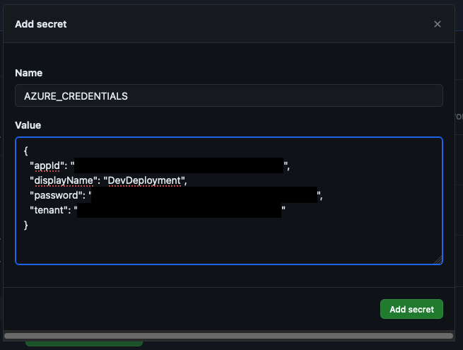

Command to create a new deployment service principal
```
az ad sp create-for-rbac -n DevDeployment --role Contributor --scopes /subscriptions/<insert-subscription-id>
```
Add the JSON output as a secret named `AZURE_CREDENTIALS` to GitHub. I've added this as a secret specific to an environment
