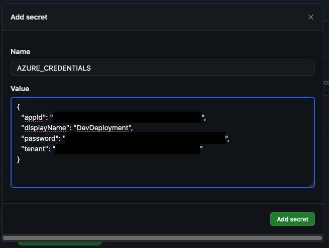

Command to create a new deployment service principal (requires the User Access Administrator role in an Azure subscription):
```
az ad sp create-for-rbac -n DevDeployment --role Contributor --scopes /subscriptions/<insert-subscription-id>/resourceGroups/<resource-group-name> --sdk-auth
```
Add the JSON output as a secret named `AZURE_CREDENTIALS` to GitHub. I've added this as a secret specific to an environment


## SSL Configuration for Blazor Client

The Blazor client uses SSL through Cloudflare and Azure:

### Architecture
- **Cloudflare**: Acts as CDN/proxy with SSL termination at the edge using existing Cloudflare certificate
- **Azure Static Web App**: Automatically provisions a managed SSL certificate for the custom domain
- **Connection Flow**: User → Cloudflare (SSL) → Azure Static Web App (SSL)

### Configuration
1. **Proxied DNS**: CNAME record with Cloudflare proxy enabled (orange cloud)
2. **Auto-Provisioned Certificate**: Azure Static Web Apps automatically handles SSL certificate provisioning and renewal
3. **SSL/TLS Settings**: Managed through Cloudflare dashboard (not in Terraform to avoid conflicts)

### Notes
- No manual certificate management required
- Azure handles certificate renewal automatically
- Cloudflare SSL/TLS mode should be set to "Full" or "Full (strict)" in the Cloudflare dashboard